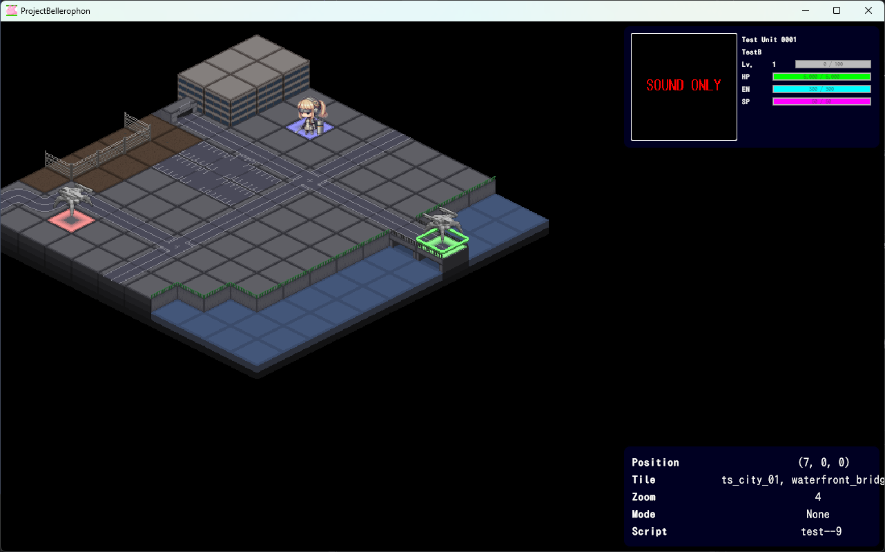
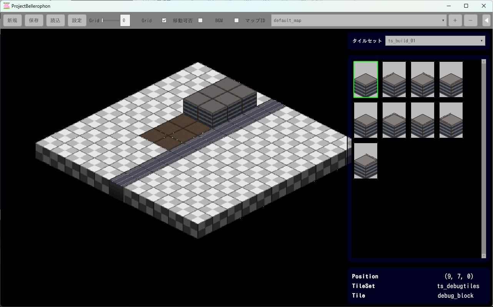

# Project Bellerophon (公開版)

Unityで開発された、データ駆動型のシミュレーションRPG（SRPG）エンジンおよびゲームプロジェクトです。

### プロジェクト概要

Project Bellerophonは、独自のスクリプトエンジンとデータ構造を備えたUnityベースのSRPG制作フレームワークです。JSONやYAML形式のデータ、およびMondスクリプトを使用することで、柔軟なシナリオ作成や戦闘計算のカスタマイズが可能です。

### 主な特徴

- **データ駆動型設計**: マップ、ユニット、キャラクター、メッセージなどのゲームデータをJSON/YAML形式で管理。
- **独自スクリプトエンジン**: 
  - イベント制御: JSONベースのコマンド形式によるイベント記述（`script/`フォルダ内）。
  - 数値計算: Mondスクリプト（`.mond`）による柔軟な戦闘計算（回避、命中、ダメージ等）。
- **Unity 6 (6000.3.0f1) 対応**: 最新のUnityバージョンで動作。
- **拡張性**: UI Toolkitを使用したエディタ機能や、UniTaskによる非同期処理の最適化。

### プロジェクト構造

- `Assets/`: Unityアセット
  - `Functions/`: ゲームロジック、マネージャー、ユーティリティクラス（C#）
  - `UserInterfaces/`: UI Toolkitを使用したユーザーインターフェース定義
  - `Packages/`: 使用されている外部ライブラリ（UniTask, VYaml, Mond, CsvCSharp等）
- `data/`: ゲーム内マスターデータ（キャラクター、ユニット、マップ等）
- `resource/`: グラフィック、音楽、フォント等のリソース
- `script/`: イベントスクリプト（JSON）および計算スクリプト（Mond）
- `documents/`: 制作マニュアルやスクリプト仕様書

### スクリプトコマンド

詳細なスクリプトコマンドについては、`documents/スクリプト.txt`を参照してください。
主なコマンドカテゴリ：
- マップ制御（マップ変更、タイル変更等）
- ユニット制御（ユニット追加、移動、ステータス変更等）
- メッセージ制御（メッセージ表示、テロップ、選択肢等）
- カメラ・オーディオ制御

### 使用技術・ライブラリ

- **Unity**: 6000.3.0f1
- **UniTask**: 非同期処理
- **VYaml**: YAMLシリアライザ
- **Mond**: スクリプト言語（計算エンジンとして使用）
- **UI Toolkit**: ユーザーインターフェース

### 最新版のダウンロード

https://nagatsuki.fanbox.cc/posts/10863045
